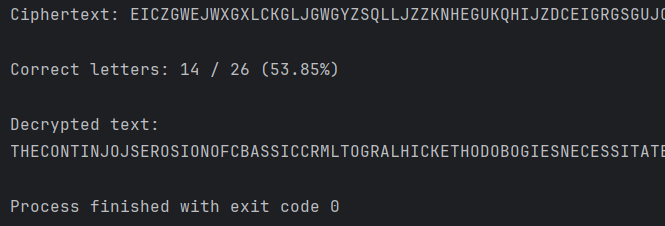
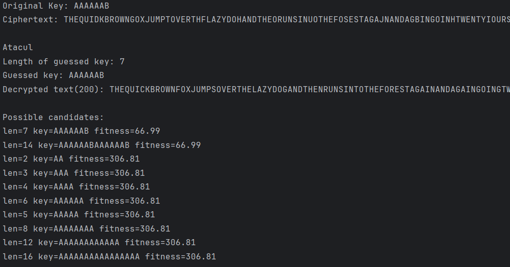
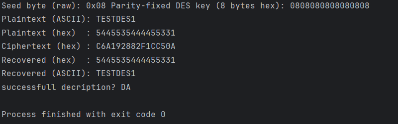
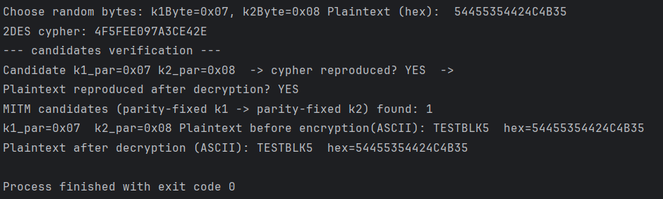
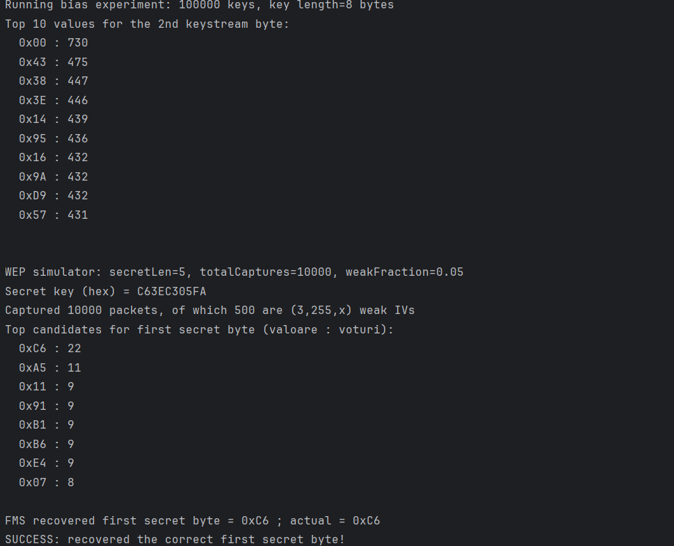
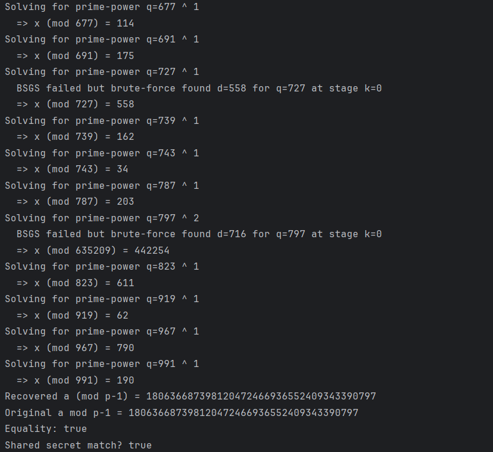
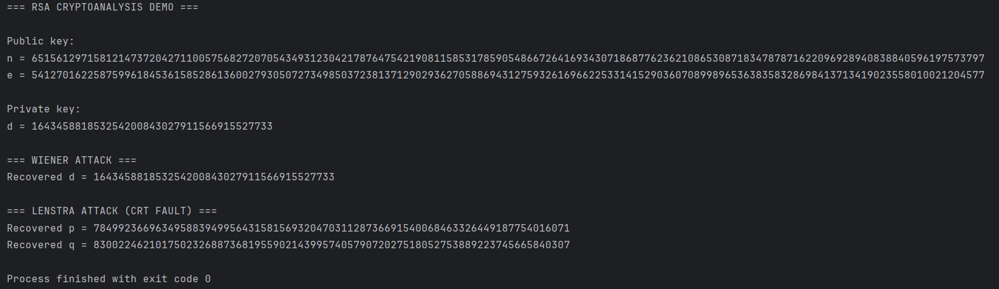

# Deprecated Cryptography Standards

This repository contains five labs focused on breaking classic cryptographic standards using statistical analysis and algorithmic attacks.

## Lab 1: Classical Ciphers

### 1. Simple Substitution Cipher
I implemented a monoalphabetic substitution cipher and a tool to break it using frequency analysis.
* **Attack**: Uses letter frequency and common patterns (digrams/trigrams) to reconstruct the key.
* **Performance**: Successfully recovered 14 out of 26 letters (53.85%) of the alphabet automatically.

---

### 2. Vigenere Cipher
I developed a Vigenere cipher implementation and a cryptanalysis module to break it without the key.
* **Key Length**: Uses statistical methods to find the key period, designed to work even for repetitive keys.
* **Key Recovery**: Analyzes character frequency across cosets to find the exact secret key.
* **Result**: Correctly identified the key length (7) and recovered the original key `AAAAAAB`.

---

## Lab 2: Data Encryption Standard (DES)

### 3. DES Implementation
I implemented the standard DES encryption and decryption process.
* **Key Handling**: Uses parity-fixed 8-byte keys to follow standard DES requirements.
* **Verification**: Successfully encrypted and decrypted the test block `TESTDES1`.

---

### 4. Meet-in-the-Middle Attack (2DES)
I developed an attack to demonstrate why double DES (2DES) does not provide double security.
* **Attack**: Finds matching intermediate values from both ends of the encryption process to reduce search time.
* **Result**: Successfully recovered secret keys `k1=0x07` and `k2=0x08` for the test block `TESTBLK5`.

---

## Lab 3: Stream Ciphers and WEP

### 5. RC4 Bias and FMS Attack
I analyzed the RC4 stream cipher and its specific vulnerabilities in WEP security.
* **Keystream Bias**: Confirmed a statistical bias where the second byte of the keystream is frequently `0x00`.
* **FMS Attack**: Exploited weak Initialization Vectors (IVs) to recover secret WEP keys.
* **Result**: Correctly recovered the first secret byte `0xC6` from 10,000 captured packets.

---

## Lab 4: Discrete Logarithm Attacks

### 6. Silver-Pohlig-Hellman Attack
I implemented an attack on the Diffie-Hellman protocol when weak prime parameters are chosen.
* **Attack**: Combines the SPH framework with Shanks' algorithm to solve the discrete logarithm problem.
* **Result**: Successfully recovered the secret exponent `a` by exploiting prime numbers with small factors.

---

## Lab 5: RSA Cryptanalysis

### 7. Wiener’s and Lenstra’s Attacks
I implemented two attacks targeting RSA vulnerabilities in key generation and implementation.
* **Wiener’s Attack**: Recovers the private key `d` when it is chosen too small relative to the modulus.
* **Lenstra’s Attack**: Exploits CRT implementation faults to recover the secret primes `p` and `q`.

